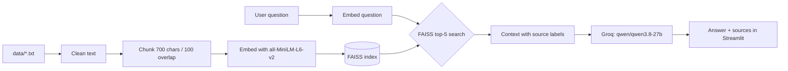

# 🌐 NetGuide AI — Cisco CCNA Knowledge Assistant

NetGuide AI is a **Retrieval-Augmented Generation (RAG)** chatbot for Cisco CCNA students.
It answers questions **only** from a curated CCNA knowledge base, cites the documents it used,
and shows the exact passages it retrieved, so you can check every answer.

| Component        | Technology                                   |
| ---------------- | -------------------------------------------- |
| User interface   | Streamlit (custom CSS, chat UI)              |
| Embedding model  | `sentence-transformers/all-MiniLM-L6-v2`     |
| Vector database  | FAISS (`IndexFlatIP`, cosine similarity)     |
| LLM              | `qwen/qwen3.8-27b` via the Groq API          |
| Knowledge base   | 37 CCNA topic documents (`data/*.txt`)       |

---

## ✨ Features

- **Modern chat UI**: right-aligned user bubbles, left-aligned assistant cards, avatars, timestamps,
  an animated typing indicator and fade-in messages
- **Suggested questions**: one click sends the question
- **Sources Used**: an expandable card for each retrieved chunk, with document name, similarity rank and a content preview
- **Retrieval Panel**: similarity-score bars for the top-k chunks, which makes the RAG step visible in a presentation
- **Per-answer statistics**: response time, number of chunks retrieved, documents referenced
- **Grounded answers**: if the answer is not in the documents, the bot replies `ไม่พบข้อมูลในเอกสารที่มี`
- **Multilingual**: answers in the same language as the question (e.g. English or Thai)
- **Session memory**: chat history is stored in `st.session_state`
- **Follow-up questions**: questions like *"How do I configure it?"* are searched together with the previous question
- **Error handling**: clear panels for a missing API key, API errors and "No relevant documents found"
- **Responsive**: works on desktop, tablet and mobile

---

## 🏗️ Architecture

```
┌────────────────────────────────────────────────────────────┐
│ STARTUP  (runs once, cached with st.cache_resource)        │
├────────────────────────────────────────────────────────────┤
│ data/*.txt  (37 CCNA topic documents)                      │
│    │                                                       │
│    ├─▶ 1. Load .txt files                                  │
│    ├─▶ 2. Clean text                                       │
│    ├─▶ 3. Split into chunks   (700 chars, 100 overlap)     │
│    ├─▶ 4. Embed chunks        (all-MiniLM-L6-v2, 384-d)    │
│    └─▶ 5. Store in FAISS      (IndexFlatIP = cosine)       │
└────────────────────────────────────────────────────────────┘
                              │
                              ▼
┌────────────────────────────────────────────────────────────┐
│ EVERY QUESTION                                             │
├────────────────────────────────────────────────────────────┤
│ User question  (st.chat_input or suggestion button)        │
│    │                                                       │
│    ├─▶ 6. Embed the question  (same model)                 │
│    ├─▶ 7. FAISS search        (top-k = 5)                  │
│    ├─▶ 8. Build context       ([Source n: FILE.txt] ...)   │
│    └─▶ 9. Groq LLM            (qwen/qwen3.8-27b)           │
└────────────────────────────────────────────────────────────┘
                              │
                              ▼
┌────────────────────────────────────────────────────────────┐
│ STREAMLIT UI                                               │
├────────────────────────────────────────────────────────────┤
│ Answer with citations                                      │
│ Sources Used cards  ·  Retrieval Panel (similarity bars)   │
│ Response time  ·  chunks retrieved  ·  documents referenced│
└────────────────────────────────────────────────────────────┘
```



---

## 🔄 How the RAG workflow works

1. **Load documents**: every `.txt` file in `data/` is read when the app starts.
2. **Clean text**: line endings are normalised, control characters are removed and extra whitespace is collapsed.
3. **Chunking**: each document is split into chunks of about **700 characters** with **100 characters of overlap**.
   The splitter tries to end chunks on paragraph or sentence boundaries, so ideas are not cut in half.
4. **Embedding**: every chunk is converted into a 384-dimensional vector with `all-MiniLM-L6-v2`.
   The topic name (taken from the file name) is added before each chunk when it is embedded. This helps
   chunks that contain mostly commands to still match questions about their topic.
5. **Indexing**: the vectors are L2-normalised and stored in a FAISS `IndexFlatIP` index, so the inner product
   equals **cosine similarity**. Steps 1–5 run once and are cached with `st.cache_resource`.
6. **Retrieval**: the question is embedded the same way, and FAISS returns the **top 5** most similar chunks.
   Chunks with a similarity below `0.20` are discarded. If none remain, the UI shows *"No relevant documents found."*
   **Follow-up questions:** if the best match is weak (below `0.45`) or the question contains a referring word such as
   *it / this / they* (or Thai *มัน / นี้ / นั้น*), the previous question is added to the search and the two result lists
   are merged, keeping the best score for each chunk. So *"What is SNMP?"* followed by *"Which ports does it use?"*
   still retrieves `SNMP.txt`.
7. **Prompting**: the retrieved chunks are labelled with their source file (e.g. `[Source 1: OSPF.txt]`) and placed
   in the system prompt, together with the rules below.
8. **Generation**: Groq runs `qwen/qwen3.8-27b` (temperature 0.1) and returns the answer, which cites its sources.

> **Why not Llama 3.3 70B?** The original brief specified `llama-3.3-70b-versatile`, but Groq has retired it (the API
> returns *404 model_not_found*). `qwen/qwen3.8-27b` and `openai/gpt-oss-120b` were both tested on the same RAG
> prompts. Both answered correctly and returned `ไม่พบข้อมูลในเอกสารที่มี` for out-of-scope questions. Qwen was chosen
> because it cites the source file name (e.g. `[Source 1: STP.txt]`), keeps Thai answers fully in Thai, and responds faster.
> To switch models, change `LLM_MODEL` in `app.py`.
9. **Display**: the answer is shown with response time, chunk count, referenced documents, the *Sources Used* cards and
   the *Retrieval Panel*.

### System prompt

```
You are NetGuide AI.

Answer ONLY using the provided context.

Rules:
1. If the answer exists in the context:
   * Provide a clear answer.
   * Cite document sources.
2. If the answer is not found:
   * Reply: "ไม่พบข้อมูลในเอกสารที่มี"
3. Do not make up information.
4. Do not use outside knowledge.
5. Answer in the same language as the user's question.

Context:
{context}

Question:
{question}
```

---

## 📁 Project structure

```
NetGuide-AI/
├── app.py                        # Streamlit app: document processing, FAISS, retrieval, Groq, UI
├── requirements.txt              # Python dependencies (CPU-only PyTorch)
├── README.md                     # This file
├── test_questions.csv            # 55 evaluation questions (5 intentionally unanswerable)
├── .gitignore                    # Keeps secrets.toml and virtual environments out of git
├── .streamlit/
│   ├── config.toml               # Dark theme + server settings
│   └── secrets.toml.example      # Template for your Groq API key
└── data/                         # Knowledge base: one CCNA topic per .txt file
    ├── ACL.txt
    ├── ARP.txt
    ├── DHCP.txt
    ├── ...
    └── VLAN.txt
```

### Knowledge-base topics

Network Fundamentals · OSI Model · TCP/IP · Ethernet · MAC Addressing · ARP · IPv4 · Subnetting · IPv6 ·
VLAN · Trunking · Inter-VLAN Routing · STP · RSTP · EtherChannel · CDP/LLDP · IP Routing · Static Routing ·
OSPF · EIGRP · FHRP (HSRP/VRRP/GLBP) · DHCP · DNS · NAT · ACL · WLAN · SSH · Syslog · SNMP · NTP ·
Network Security · Device Hardening · QoS · Network Automation · JSON · REST APIs · Network Troubleshooting

Each document is about 4,500–6,000 characters and follows the same layout, designed for retrieval:

- Every section heading names its topic (e.g. *"OSPF neighbor states:"*), so each 700-character chunk makes sense on its own.
- Key facts such as timers, defaults, port numbers and AD values are written out in sentences, not only inside commands.
- Configuration examples include sample `show` output, followed by troubleshooting notes and CCNA exam tips.
- Each document ends with a **"Common questions about <topic>"** Q&A section. Question-shaped text sits close to real
  user questions in embedding space, which noticeably improves retrieval.

To add knowledge, drop a new `.txt` file into `data/` and restart the app. The index is rebuilt automatically.

---

## ⚙️ Setup (local)

**Requirements:** Python **3.10 or newer** (3.11 or 3.12 recommended) and a free Groq API key.

```bash
# 1. Clone the repository
git clone https://github.com/<your-username>/<your-repo>.git
cd <your-repo>

# 2. Create and activate a virtual environment
python -m venv .venv
# Windows
.venv\Scripts\activate
# macOS / Linux
source .venv/bin/activate

# 3. Install dependencies
pip install -r requirements.txt

# 4. Add your Groq API key
#    Copy the example file, then paste your key into it
cp .streamlit/secrets.toml.example .streamlit/secrets.toml     # Windows: copy .streamlit\secrets.toml.example .streamlit\secrets.toml

# 5. Run the app
streamlit run app.py
```

`.streamlit/secrets.toml` should look like this:

```toml
GROQ_API_KEY = "gsk_your_key_here"
```

Get a free key at <https://console.groq.com/keys>. The app also accepts a `GROQ_API_KEY` environment variable.

> On the first run, the app downloads the embedding model (~90 MB) from Hugging Face. Later runs use the cached copy.

---

## ☁️ Deployment (Streamlit Community Cloud)

1. Push the project to a **public or private GitHub repository**.
   `secrets.toml` is listed in `.gitignore`. **Never commit your API key.**
2. Go to <https://share.streamlit.io> and click **Create app → Deploy a public app from GitHub**.
3. Select your repository and branch, and set **Main file path** to `app.py`.
4. Open **Advanced settings**:
   - **Python version**: choose 3.11 or 3.12
   - **Secrets**: paste
     ```toml
     GROQ_API_KEY = "gsk_your_key_here"
     ```
5. Click **Deploy**. The first build takes a few minutes while dependencies install and the model downloads.

To change the key later, open **App settings → Secrets**, save, and **Reboot** the app.

**Why CPU-only PyTorch?** `requirements.txt` installs `torch` from the PyTorch CPU wheel index. Streamlit Cloud has
no GPU, and the CPU build is much smaller, so installs are faster and stay within the memory limit.

---

## 💬 Example questions

| Question                                                 | Expected source            |
| -------------------------------------------------------- | -------------------------- |
| What is VLAN?                                            | `VLAN.txt`                 |
| Explain OSPF Areas.                                      | `OSPF.txt`                 |
| How does DHCP Relay work?                                | `DHCP.txt`                 |
| Difference between Standard and Extended ACL?            | `ACL.txt`                  |
| What are the port roles in RSTP?                         | `RSTP.txt`                 |
| How do I configure SSH on a Cisco router?                | `SSH.txt`                  |
| What are the eight Syslog severity levels?               | `Syslog.txt`               |
| Which DSCP value is used for voice traffic?              | `QoS.txt`                  |
| Which HTTP methods map to CRUD operations in REST?       | `REST_APIs.txt`            |
| IPv6 link-local address คืออะไร                          | `IPv6.txt`                 |
| What is the default HSRP priority?                       | `FHRP.txt`                 |
| What is SNMP? → *Which ports does it use?* (follow-up)   | `SNMP.txt`                 |
| How do you configure BGP route reflectors? *(no answer)* | → `ไม่พบข้อมูลในเอกสารที่มี` |

The full list of 55 questions is in [`test_questions.csv`](test_questions.csv), with these columns:

| Column                    | Meaning                                                    |
| ------------------------- | ---------------------------------------------------------- |
| `id`                      | Question number                                            |
| `question`                | The question to ask                                        |
| `expected_source`         | Document that should be retrieved (`none` if unanswerable) |
| `answerable`              | `yes` / `no`                                               |
| `expected_answer_summary` | Short summary of the correct answer                        |

### Retrieval check (no API key needed)

Each answerable question was embedded and searched with the app's own `retrieve()` function, to check whether its
`expected_source` document appears in the top 5 retrieved chunks:

| Metric                                             | Result                  |
| -------------------------------------------------- | ----------------------- |
| Expected document in top 5 (answerable questions)  | **50 / 50**             |
| Expected document ranked #1                        | **46 / 50**             |
| Follow-up questions resolved with the previous one | **5 / 5**               |
| Knowledge-base size                                | 37 documents, 420 chunks |

The 5 unanswerable questions retrieve only loosely related chunks. The LLM is then expected to reply
`ไม่พบข้อมูลในเอกสารที่มี`, which you can confirm by asking them in the app.

---

## 🔧 Configuration

All settings are constants at the top of `app.py`:

| Setting           | Default                   | Description                                     |
| ----------------- | ------------------------- | ----------------------------------------------- |
| `CHUNK_SIZE`      | `700`                     | Target chunk length in characters               |
| `CHUNK_OVERLAP`   | `100`                     | Characters shared by neighbouring chunks        |
| `TOP_K`           | `5`                       | Number of chunks retrieved per question         |
| `MIN_SIMILARITY`  | `0.20`                    | Chunks below this cosine similarity are dropped |
| `FOLLOWUP_THRESHOLD` | `0.45`                 | Below this best score, the previous question is added to the search |
| `EMBEDDING_MODEL` | `all-MiniLM-L6-v2`        | sentence-transformers model                     |
| `LLM_MODEL`       | `qwen/qwen3.8-27b`        | Groq model                                      |
| `LLM_TEMPERATURE` | `0.1`                     | Low temperature for factual answers             |

---

## 🩺 Troubleshooting

| Problem                                  | Fix                                                                               |
| ---------------------------------------- | --------------------------------------------------------------------------------- |
| "Groq API key not found" panel           | Add `GROQ_API_KEY` to `.streamlit/secrets.toml` or to the Cloud **Secrets** box   |
| "The Groq API key was rejected"          | The key is wrong or revoked. Create a new one at console.groq.com                 |
| "Rate limit reached"                     | The free tier has per-minute limits. Wait a few seconds and ask again             |
| "No relevant documents found"            | The question is outside the knowledge base. Rephrase it or add a document         |
| App is slow on the first start           | The embedding model is downloading and the index is building. This happens once   |

---

## 📜 License

Built for educational purposes. Cisco, CCNA and IOS are trademarks of Cisco Systems, Inc.
This project is not affiliated with Cisco.
